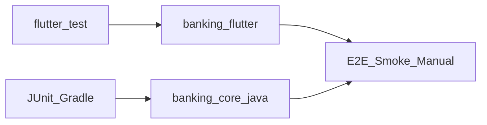

# Báo cáo kiểm thử — Backend Java & Frontend Flutter

## Phạm vi và nguyên tắc

- **Phạm vi:** chỉ `banking_core_java` và `banking_flutter`. **Không** đánh giá `banking_admin` trong báo cáo này.
- **Nguyên tắc:** ưu tiên bằng chứng tự động (Gradle / Flutter test); E2E thực tế cần môi trường chạy BE + DB + Redis và được ghi riêng khi thực hiện.
- **Định dạng tài liệu:** file `.md` dùng **YAML frontmatter** (`name`, `overview`, `todos`, `isProject`) giống plan Cursor để dễ theo dõi trạng thái và tái sử dụng cho các báo cáo/plan sau.

## Tóm tắt điều hành

| Hạng mục | Kết luận |
|----------|----------|
| **Backend Java** (`./gradlew test`) | **Đạt** — build test thành công; 3 test tự động pass. |
| **Flutter** (`flutter test`) | **Không đạt** — test mẫu sai package/import; không phản ánh runtime app. |
| **E2E Flutter ↔ Java BE** | **Chưa có bằng chứng** — không chạy server trong phiên báo cáo. |
| **Cấu hình cổng** | **Cần lưu ý** — Flutter mặc định port khác Java (xem mục Cấu hình). |

**Kết luận:** BE Java có lớp test tự động pass ở mức unit/smoke nhỏ; Flutter cần sửa test + khuyến nghị chạy smoke E2E khi BE sẵn sàng. Chưa khẳng định “toàn pipeline mobile ↔ API” chỉ dựa trên báo cáo này.

## Kiến trúc kiểm thử (tham chiếu)



## Kết quả tổng hợp

| Module | Lệnh | Kết quả |
|--------|------|---------|
| `banking_core_java` | `./gradlew.bat test` | **PASS** |
| `banking_flutter` | `flutter test` | **FAIL** (compile test) |
| E2E | Không chạy | **N/A** |

## Chi tiết — Backend Java

**Lệnh:** `./gradlew.bat test --no-daemon`  
**Kết quả:** `BUILD SUCCESSFUL`

| ID | Test | Mô tả | Kết quả |
|----|------|-------|---------|
| TC-J-01 | `BankingCoreJavaApplicationTests` | Smoke class application | Pass |
| TC-J-02 | `AdminServiceTest.getSystemStats_shouldReturnAggregatedValues` | Mock port — stats aggregate | Pass |
| TC-J-03 | `CustomUserDetailsServiceTest.loadUserByUsername_shouldMapRolesToAuthorities` | Role → `ROLE_*` | Pass |

**Gap test tự động (khuyến nghị):**

- Integration Testcontainers (Postgres + Redis) cho auth / transfer / OTP.
- Contract test response so với hợp đồng API mà Flutter đang dùng.

## Chi tiết — Flutter

**Lệnh:** `flutter test`  
**Kết quả:** **FAIL**

**Nguyên nhân:** `test/widget_test.dart` import `package:banking_flutter/main.dart` trong khi package trong [banking_flutter/pubspec.yaml](D:/Code/My_Project/Banking-System/banking_flutter/pubspec.yaml) là `chidi_bank`; constructor `MyApp` không khớp.

| ID | Mô tả | Kết quả |
|----|--------|---------|
| TC-F-01 | Widget test mặc định | **Blocked** |

## Cấu hình API & cổng (Java ↔ Flutter)

- Flutter: [banking_flutter/lib/src/config/api_config.dart](D:/Code/My_Project/Banking-System/banking_flutter/lib/src/config/api_config.dart) — `serverPort` mặc định **3002**.
- Java: [banking_core_java/src/main/resources/application.yml](D:/Code/My_Project/Banking-System/banking_core_java/src/main/resources/application.yml) — `server.port` mặc định **3001** (qua `PORT`).

**Khuyến nghị:** thống nhất một cổng hoặc đọc từ `--dart-define` / file env để tránh gọi sai BE.

## Ma trận test case (chỉ Java + Flutter)

Chú thích: **A** = có bằng chứng tự động trong báo cáo; **M** = khuyến nghị test thủ công / E2E; **—** = chưa có bằng chứng.

| Nhóm | Test case | Kỳ vọng | BE Java | Flutter app |
|------|-----------|---------|---------|---------------|
| Auth | Login studentId/password | 200 + token | M | M |
| Auth | Register / refresh / logout | Theo contract | M | M |
| Banking | GET accounts, dashboard summary | `success` + data | M | M |
| Banking | Transfer + verify OTP + resend OTP | Trạng thái đúng | M | M |
| User | Profile, KYC status, display currency | JSON hợp lệ | M | M |
| Notification | List, unread, mark read | Đúng schema | M | M |
| Card | CRUD/limit theo API đang expose | Theo contract | M | M |
| Non-functional | Health (`/actuator/health`) | 200 | M | — |

## Khuyến nghị (ưu tiên)

1. Đồng bộ **cổng** giữa Flutter config và Java `server.port`.
2. Sửa **`test/widget_test.dart`** (package `chidi_bank`, widget entry đúng) để `flutter test` xanh trên CI.
3. Thực hiện **smoke E2E** có checklist: login → dashboard → một luồng banking (nếu có tài khoản test); cập nhật todo `qa-e2e-smoke` trong frontmatter khi xong.
4. Bổ sung integration test Java cho luồng tiền tệ (transfer + OTP) khi có thể.

## Phụ lục — Log rút gọn

**Java**

```text
BUILD SUCCESSFUL
```

**Flutter (lỗi)**

```text
Couldn't resolve the package 'banking_flutter' in 'package:banking_flutter/main.dart'
```

---

## Ghi chú định dạng cho báo cáo / plan sau

Khi báo cáo hoặc lập plan trong repo, dùng cùng pattern:

1. **YAML frontmatter** đầu file: `name`, `overview`, `todos` (mỗi todo có `id`, `content`, `status`: `pending` | `in_progress` | `completed`), `isProject: false` nếu không phải project Cursor.
2. **Tiêu đề H1** một dòng sau frontmatter.
3. **Mục tiêu / phạm vi** ngắn gọn, có bảng tóm tắt khi cần.
4. **Mermaid** tùy chọn cho luồng hoặc phase.
5. **Link đầy đủ** tới file trong repo khi trích dẫn đường dẫn.

*Tài liệu cập nhật theo yêu cầu: phạm vi chỉ Java + Flutter; định dạng tham chiếu plan Cursor.*
